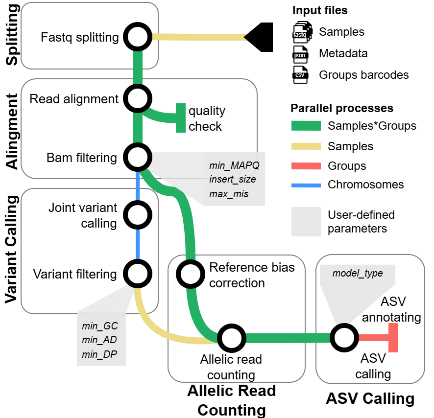

## NEXT-scASV

### Abstract
NEXT-scASV (Nextflow pipeline for Allele-Specific Variant calling), a scalable Nextflow pipeline for calling allele-specific variants (ASVs) from 5′ single-cell RNA sequencing data. NEXT-scASV integrates established tools for alignment (HISAT2), reads deduplication  (umi_tools), variant calling (bcftools mpileup), reference bias correction (WASP), and advanced statistical modeling (MIXALIME). The pipeline consists of five main subflows: (i) Data Splitting, (ii) Alignment and Filtering, (iii) Variant Calling, (iv) Allelic Read Counting, and (v) ASV Calling. 

<div align="center">

</div>

### 1) Installation

- **Create Conda env (recommended)**
  - Using the provided env file:
    ```bash
    conda env create -f as_env.yml
    conda activate as_env
    export LD_LIBRARY_PATH=$CONDA_PREFIX/lib:$LD_LIBRARY_PATH
    ```

  - Follow `https://github.com/bmvdgeijn/WASP` installation (use v0.3.4).
  - In `WASP/mapping/snptable.py` change `np.int` → `int` (NumPy ≥ 1.20 deprecates `np.int`).

- **Add Nextflow to `bin/`**
  - Download Nextflow and place it in this repo's `bin` folder:
    ```bash
    curl -s https://get.nextflow.io > nextflow
    mv nextflow bin/nextflow
    chmod +x bin/nextflow
    ```

- **Docker**
  - A `Dockerfile` is provided. It installs Nextflow, HISAT2, and WASP.
  - Build the image from the project root:
    ```bash
    docker build -t asv-pipeline:latest .
    ```
  - Run the pipeline inside the container (bind-mount your data/config/output):
    ```bash
    docker run --rm -it \
      -v /path/to/data:/data \
      -v /path/to/config:/config \
      -v /path/to/out:/out \
      asv-pipeline:latest \
      ./bin/nextflow run /app/main.nf -c /config/nextflow.config
    ```
  - If running inside the container, set `docker.enabled = false` in the config to avoid Docker-in-Docker.

### 2) Supplementary files

- Load supplementary annotation/model files from the archive (to be provided later). Place annotation files under `bin/annotation/`.

### 2a) Download reference files

Download and prepare the reference resources required by the pipeline. Paths are then set in `nextflow.config` (see Section 3).

- **Reference genome FASTA**
  - Download the GRCh38 primary assembly FASTA.
  - Example sources: GENCODE, Ensembl, or UCSC (choose one and stay consistent).
  - Ensure the FASTA is bgzipped (optional) and indexed with `samtools faidx`.

- **HISAT2 index**
  - Download a prebuilt HISAT2 index matching the same genome build **or** build it yourself:
    ```bash
    hisat2-build /path/to/GRCh38.fa /path/to/hisat2_index/GRCh38
    ```
  - Only required when `params.aligner = "hisat2"`.

- **STAR index**
  - Build a STAR genome index (matching the same genome build):
    ```bash
    STAR --runThreadN 8 --runMode genomeGenerate \
      --genomeDir /path/to/star_index \
      --genomeFastaFiles /path/to/GRCh38.fa
    ```
  - Only required when `params.aligner = "star"`.

- **dbSNP VCF**
  - Download the dbSNP VCF for the same genome build (e.g., `dbsnp_155.hg38.vcf.gz`).
  - Make sure it is bgzipped and indexed:
    ```bash
    bcftools index -t /path/to/dbsnp.vcf.gz
    ```

- **Chromosome lists and sizes**
  - Provide text files with autosomes, nuclear chroms, and chrom sizes as required by the config.
  - Example: `Genome_no_chr/GRCh38.primary_assembly.genome.chrom_sizes` (already in this repo).

### 3) Configure `nextflow.config`

Modify `nextflow.config` in the project root. Key parameters (see `nextflow_dev.config` for full list and defaults):

- **I/O and temp**
  - `params.input`: Input directory. 
  - `params.outdir`: Output directory.
  - `params.tmp_dir`: Temporary directory (writable, large enough).

- **Metadata**
  - `params.split_table`: Path to split table TSV (check `tests/split_table.tsv` for expample).
  - `params.meta_json`: Path to sample metadata JSON (check `tests/meta.json` for example).

- **References**
  - `params.genome`, `params.ref_genome`: reference FASTA paths (as required by your workflows).
  - `params.hisat2_index`: Prefix to HISAT2 index.
  - `params.star_index`: STAR genome directory (required if `params.aligner = "star"`).
  - `params.dbsnp`: dbSNP VCF (bgzipped and indexed).
  - `params.autosomes`, `params.nuclear_chroms`, `params.genome_chrom_sizes`: text tables files with chrom lists and sizes (each chrom on the separate line).

- **Workflow toggles**
  - `params.run_split`, `params.run_remap`, `params.run_call`, `params.run_count_reads`, `params.run_find_ase`: set `true/false` to enable steps.

- **Alignment**
  - `params.aligner`: `'hisat2'` (default) or `'star'`.

- **Calling/Filtering**
  - `params.min_GQ`, `params.min_DP`, `params.min_AD`: genotype quality/depth thresholds.
  - `params.variant_caller`: variant calling backend for the CALL step (`bcftools` or `cellsnp`).
    - For `cellsnp`, the pipeline runs **cellsnp-lite Mode 2b** per chromosome (no `-R`, no `-b`, `--cellTAG None --UMItag None`) and uses `params.6` / `params.cellsnp_minCOUNT`.

- **Count/ASE**
  - `params.h5_files_b`: optional H5 directory (set `null` to generate from scratch).
  - `params.model`: ASE model, e.g. `BetaNB`.
  - `params.annotation_meta_dir`: directory with annotation pickles; `null` to use defaults under `bin/annotation/`.

- **Process/Cluster**
    ```
    process {
        executor = 'slurm'
        queue = '<name>'
        memory = '64 GB'
        cpus = 8
    }
    ```

### 5) Run

```bash
./bin/nextflow run main.nf -c nextflow.config
```

- If running with Docker explicitly:
```bash
./bin/nextflow run main.nf -c nextflow.config -with-docker
```

Outputs will be created under `params.outdir` with subfolders for each step (e.g., `split/`, `align/`, `count_reads/`, `find_ase/`) and reports in `reports/` if enabled.

### 5) Pipeline steps (toggle on/off)

Use the step flags to run specific stages. For example:

```bash
# 1) Split FASTQ files
./bin/nextflow run main.nf -c nextflow.config \
  --run_split true --run_remap false --run_call false --run_count_reads false --run_find_ase false

# 2) Remap reads
./bin/nextflow run main.nf -c nextflow.config \
  --run_split false --run_remap true --run_call false --run_count_reads false --run_find_ase false

# 3) Variant calling
./bin/nextflow run main.nf -c nextflow.config \
  --run_split false --run_remap false --run_call true --run_count_reads false --run_find_ase false

# 4) Count reads
./bin/nextflow run main.nf -c nextflow.config \
  --run_split false --run_remap false --run_call false --run_count_reads true --run_find_ase false

# 5) Find ASE (includes annotation)
./bin/nextflow run main.nf -c nextflow.config \
  --run_split false --run_remap false --run_call false --run_count_reads false --run_find_ase true
```
